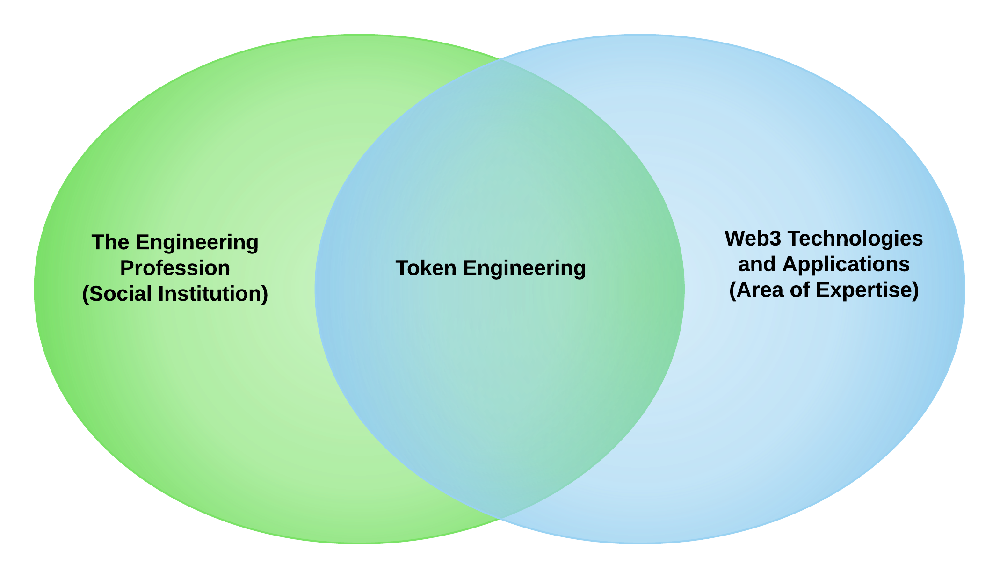
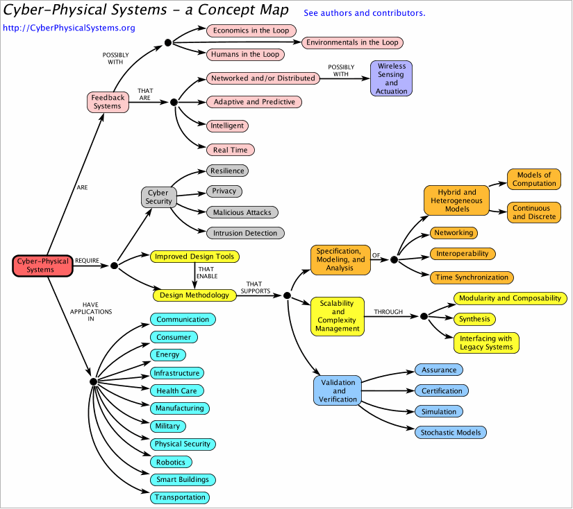

# Welcome to the Token Engineering Community

Our community is a technology-enabled social organization committed to the application of web3 technologies to achieve human-centric outcomes. Much like traditional engineering societies we engage in research, education, and standard setting in addition to designing, building and maintaining socio-technological solutions.

Web3 technologies encompass web-based cryptographically secured social and economic infrastructure and applications. As with any emerging technology there is still a lot of uncertainty around the practice of engineering web3 enabled systems but it is already clear that these systems are deeply entangled with social and economic systems, and thus have the potential for a transforming impact on our social institutions. 

We are at the tipping point in the transformation from industrial to information age. With this in mind, our community coalesced around a shared commitment to the values upheld by the broader institution of professional engineering. While it remains unclear where the web3 technologies will carry our society and vice versa, we believe that the journey must be undertaken with a values-first mindset.

## The Professional Engineering Values System

Engineering Values according to **Martin, M. & Schinzinger, R. Ethics in Engineering. NY: McGraw-Hill, 1983:**

(1) a primary obligation to protect the safety of and respect the right of consent of human subjects;

(2) a constant awareness of the experimental nature of any project, imaginative forecasting of its possible side effects, and a reasonable effort to monitor them;

(3) autonomous, personal involvement in all steps of a project; and 

(4) accepting accountability for the results of a project. 

Engineering Values according to **Pinkus, R. L. B, Shuman, L. J., Hummon, N. P., Wolfe, H. Engineering Ethics: Balancing Cost, Schedule, and Risk—Lessons Learned from the Space Shuttle. Cambridge: Cambridge University Press, 1997.**

*“The ethical engineer is one who is competent, responsible, and respectful of [Cicero’s Creed II](https://www.encyclopedia.com/science/encyclopedias-almanacs-transcripts-and-maps/ciceros-creed). Cicero’s Creed, engineering’s oldest ethic, directed engineers to place the safety of the public above all else.”* 

Engineering Values according to **Wike VS. Professional engineering ethical behavior: a values-based approach. age. 2001**

*Instead, I prefer a third scheme that focuses squarely on what is to be valued and not on questions of methodology or technical expertise. This scheme proposes that professional engineers (and for that matter, any professionals) share a commitment to these six values: integrity, respect for persons, justice, compassion, beneficence and nonmaleficence, and responsibility.*

## The Web3 Values System

Investors, Builders, and Early Adopters of web-based cryptographically secured social and economic infrastructure and applications have a wide range of beliefs and values but some key concepts form a common thread: privacy, transparency, and agency.

Privacy and transparency are in direct tension but this provides a fertile ground for discussing trade-offs. Agency then includes the right of humans to opt-in and out of web3 networks. Furthermore, opting in does not require an intermediary, provided you are sufficiently technically inclined to manage your own infrastructure and/or private keys. 

Another interesting tension arises in the pursuit of agency: in a network in which participants are connected, where does one's right to control their own actions meet the rights of those their actions impact? In web3 technology stack, protocols can be said to address this directly by providing an explicit specification of what actions are and are not possible within the engineered network. However, at the level of governing the protocols, the boundaries of these rights are non-obvious. 

For more on Web3 Values and History see: **Voshmgir S. Token Economy: How Blockchains and Smart Contracts Revolutionize the Economy. BlockchainHub; 2019.**

For thoughtful criticism see **Walch A. In Code (Rs) We Trust: Software Developers as Fiduciaries in Public Blockchains; 2019.**

## Reconciling Value Systems
<todo: edit, super important points need to become clearer>

At first glance, these value systems are in conflict. Simply, the authority of a traditional engineer is derived from the power of the nation-state to regulate its territory. However, the web3 value system is native to the internet, the social institution is extra-national and openly rejects the authority of any single state to regulate it. Adherents to the web3 value system adhere to regulations out of pragmaticism rather than in deference to those regulatory authorities.

Let us set aside for a moment the interpretation of the engineering profession as the institution empowered by sovereign nations to design, build and maintain technological infrastructure. Instead let's look at the engineering profession as the instution empowered by the public to safeguard their well-being in the face of technologies so broad and deep that they cannot hope to understand it all, and thus make individual judgements regarding their own safety.

Taking this latter perspective, it is possible to undertake the responsilility to safeguard the public good without first submitting to the authority of a soverign state, and their right to regulate. This reconciles with the agency aspect of the web3 value system; in choosing which systems one opts into it is possible to select for those systems one believes have been created and maintained by persons adhering to a public wellbeing first values system. Though it may take time, we believe history tells us that people want to enjoy the benefits of new technology while the underlying complexity is abstracted away from them. This is only possible when their interests are safeguarded through social institutions.

## A Path Forward

Upholding a value system is a journey not a destination; it can never be totally reduced to a set of methods and procedures but drawing on methods and procedures is a good place to start. In particular the Token Engineering community has been committed to improving design methodologies and associated tools drawing on the engineering subfield of Cyber-physical Systems (CPS). [Wikipedia](https://en.wikipedia.org/wiki/Cyber-physical_system) defines CPS as follows:

*A CPS is a system in which a mechanism is controlled or monitored by computer-based algorithms. In CPS, physical and software components are deeply intertwined, able to operate on different spatial and temporal scales, exhibit multiple and distinct behavioral modalities, and interact with each other in ways that change with context.[1] Examples of CPS include smart grid, autonomous automobile systems, medical monitoring, industrial control systems, robotics systems, and automatic pilot avionics.[2]*

*CPS involves transdisciplinary approaches, merging theory of cybernetics, mechatronics, design and process science.[3][4] The process control is often referred to as embedded systems. In embedded systems, the emphasis tends to be more on the computational elements, and less on an intense link between the computational and physical elements. CPS is also similar to the Internet of Things (IoT), sharing the same basic architecture; nevertheless, CPS presents a higher combination and coordination between physical and computational elements.*

See Image Source, Ptolemy Project, UC Berkeley [Cyber-Physical Systems](https://ptolemy.berkeley.edu/projects/cps/)

In **Voshmgir S, Zargham M. Foundations of cryptoeconomic systems, 2020** a case is made that the web3 internet native social and economic infrastructure projects should be approached as Cyber-physical systems. While CPS predates web3, it is also plagued by ethical questions as algorithms take the role of administrating policies, which directly impact human activies. 

However, the growing crisis of AI explainability and prediction algorithms, creating self-fulfilling prophecies, shows us that technological expertise alone is insufficient for upholding a public wellbeing-first value system. On an even grander scale, our existing public institutions have visibly failed to address systemic challenges such as global warming and acute public health crises. 

As such we look beyond the boundaries of our technical fields to experts in the humanities and social sciences with a particular need for those studied in ethics, law and governance. Our community is open to all who wish to take up the burden of safeguarding the public, not because a regulatory authority demands it, but because it is a role in society necessitated by the existence of technology.

Following in the engineering tradition, the Token Engineering community has worked on human-centric design methodologies and associated design tools in a manner associated with system safety in complex engineered systems. The state of the art in the broader engineering domain can be found in **Leveson NG. Engineering a safer world. The MIT Press; 2016.**

The Token Engineering community's goal is to extend the state of the art, to embed human-centric co-design and improvement into engineered complex adaptive systems that web3 technologies enable.
